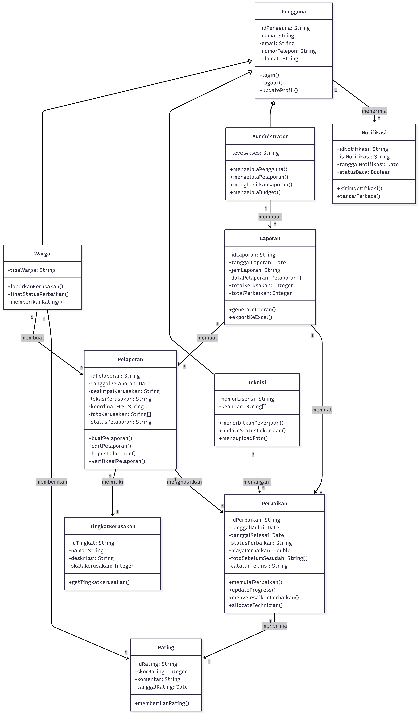
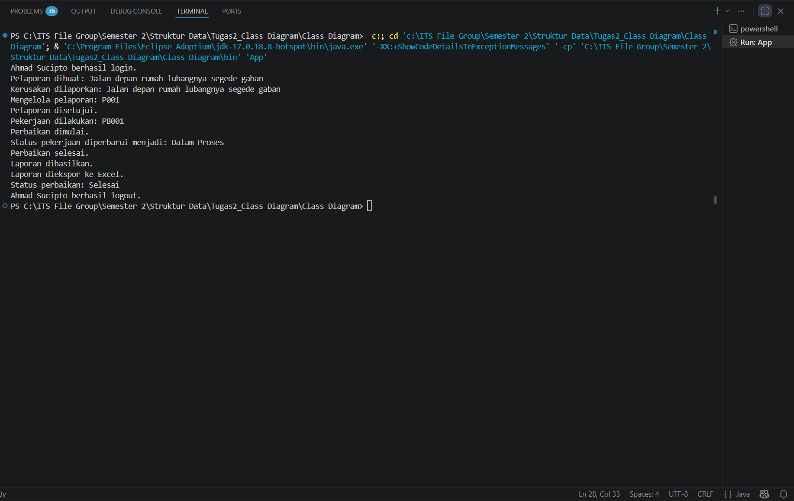

# TUGAS CLASS DIAGRAM

### Deskripsi Kasus

Kasus di kehidupan sehari-hari yang saya ambil adalah sebuah isu dimana banyak jalan/trotoar yang ada di Indonesia sudah rusak, namun minim adanya perbaikan yang dilakukan. Melalui permasalahan ini saya membayangkan sebuah sistem terintegrasi yang dapat menjembatani antara petugas konstruksi dan warga setempat terkait pelaporan jalan berlubang serta perbaikan yang dilakukan.

### Class Diagram

Berdasarkan deskripsi tersebut, saya menggunakan `Mermaid.ai` untuk membantu membuatkan saya Class Diagram tentang sistem tersebut. Dan didapatkan hasilnya seperti berikut:

```mmd
classDiagram
    class Pengguna {
        -idPengguna: String
        -nama: String
        -email: String
        -nomorTelepon: String
        -alamat: String
        +login()
        +logout()
        +updateProfil()
    }

    class Warga {
        -tipeWarga: String
        +laporkanKerusakan()
        +lihatStatusPerbaikan()
        +memberikanRating()
    }

    class Teknisi {
        -nomorLisensi: String
        -keahlian: String[]
        +menerbitkanPekerjaan()
        +updateStatusPekerjaan()
        +menguploadFoto()
    }

    class Administrator {
        -levelAkses: String
        +mengelolaPengguna()
        +mengelolaPelaporan()
        +menghasilkanLaporan()
        +mengelolaBudget()
    }

    class Pelaporan {
        -idPelaporan: String
        -tanggalPelaporan: Date
        -deskripsiKerusakan: String
        -lokasiKerusakan: String
        -koordinatGPS: String
        -fotoKerusakan: String[]
        -statusPelaporan: String
        +buatPelaporan()
        +editPelaporan()
        +hapusPelaporan()
        +verifikasiPelaporan()
    }

    class TingkatKerusakan {
        -idTingkat: String
        -nama: String
        -deskripsi: String
        -skalaKerusakan: Integer
        +getTingkatKerusakan()
    }

    class Perbaikan {
        -idPerbaikan: String
        -tanggalMulai: Date
        -tanggalSelesai: Date
        -statusPerbaikan: String
        -biayaPerbaikan: Double
        -fotoSebelumSesudah: String[]
        -catatanTeknisi: String
        +memulaiPerbaikan()
        +updateProgress()
        +menyelesaikanPerbaikan()
        +allocateTechnician()
    }

    class Rating {
        -idRating: String
        -skorRating: Integer
        -komentar: String
        -tanggalRating: Date
        +memberikanRating()
    }

    class Notifikasi {
        -idNotifikasi: String
        -isiNotifikasi: String
        -tanggalNotifikasi: Date
        -statusBaca: Boolean
        +kirimNotifikasi()
        +tandaiTerbaca()
    }

    class Laporan {
        -idLaporan: String
        -tanggalLaporan: Date
        -jeniLaporan: String
        -dataPelaporan: Pelaporan[]
        -totalKerusakan: Integer
        -totalPerbaikan: Integer
        +generateLaoran()
        +exportKeExcel()
    }

    Pengguna <|-- Warga
    Pengguna <|-- Teknisi
    Pengguna <|-- Administrator
    
    Warga "1" --> "*" Pelaporan : membuat
    Pelaporan "1" --> "1" TingkatKerusakan : memiliki
    Pelaporan "1" --> "*" Perbaikan : menghasilkan
    Teknisi "*" --> "*" Perbaikan : menangani
    Perbaikan "1" --> "1" Rating : menerima
    Warga "1" --> "*" Rating : memberikan
    
    Pengguna "1" --> "*" Notifikasi : menerima
    Administrator "1" --> "*" Laporan : membuat
    Laporan "1" --> "*" Pelaporan : memuat
    Laporan "1" --> "*" Perbaikan : memuat
```

Visualisasi Class Diagram:



Dengan menggunakan Class Diagram sebagai referensi, saya membuat sebuah prototipe Sistem Pelaporan dan Perbaikan Jalan Rusak yang mengambil beberapa class penting dari Class Diagram dengan menggunakan program Java.

### Kode Program Java

```java
public class App {
    public static void main(String[] args) throws Exception {
        // 1. Warga login dan membuat pelaporan
        Warga warga = new Warga("U001", "Ahmad Sucipto", "ahmdscpt123@mail.com", "08123456789", "Jl. Totok Kerot No. 10");
        warga.login();

        Pelaporan pelaporan = new Pelaporan("P001", "2026-03-25", "Jalan depan rumah lubangnya segede gaban", "Jl. Totok Kerot", "xxx,yyy", "foto_jalan.jpg", "Menunggu Verifikasi");
        pelaporan.buatPelaporan();
        warga.laporKerusakan(pelaporan);

        // 2. Administrator menerima pelaporan dan melakukan verifikasi
        Administrator admin = new Administrator("A001", "Akbar", "akubarureyf@mail.com", "0811111111", "Perumahan Dinas");
        admin.mengelolaPelaporan(pelaporan);
        pelaporan.verifikasiPelaporan('Y'); // disetujui

        // 3. Teknisi menerima pelaporan dan memulai perbaikan
        Teknisi teknisi = new Teknisi("T001", "Andik", "andi@teknisi.com", "0822222222", "Jl. Melati No. 5");
        Perbaikan perbaikan = new Perbaikan("PB001", "2026-03-26", "", "Menunggu", 500000, "udah_bener_nih.jpg", "Lubang ditambal dengan aspal");
        teknisi.pemberitahuanPekerjaan(perbaikan);
        perbaikan.memulaiPerbaikan();
        teknisi.updateStatusPekerjaan(perbaikan, "Dalam Proses");
        perbaikan.menyelesaikanPerbaikan();

        // 4. Administrator membuat laporan dari pelaporan dan perbaikan
        Pelaporan[] dataPelaporan = { pelaporan };
        Laporan laporan = new Laporan("L001", "2026-03-27", "Laporan Perbaikan Jalan", dataPelaporan, 1);
        admin.membuatLaporan(laporan);
        laporan.exportKeExcel();

        // 5. Warga melihat status perbaikan
        warga.lihatStatusPerbaikan(perbaikan);

        // Warga logout
        warga.logout();
    }
}

class User {
    //constructor
    private String idUser;
    private String nama;
    private String email;
    private String nomorTelepon;
    private String alamat;
    private String tipeUser;

    public User(String idUser, String nama, String email, String nomorTelepon, String alamat) {
        this.idUser = idUser;
        this.nama = nama;
        this.email = email;
        this.nomorTelepon = nomorTelepon;
        this.alamat = alamat;
        this.tipeUser = "";
    }

    //setter getter
    public String getIdUser() {
        return idUser;
    }
    public String getNama() {
        return nama;
    }
    public String getEmail() {
        return email;
    }
    public String getNomorTelepon() {
        return nomorTelepon;
    }
    public String getAlamat() {
        return alamat;
    }
    public String getTipeUser() {
        return tipeUser;
    }

    public void setIdUser(String newIdUser) {
        this.idUser = newIdUser;
    }
    public void setNama(String newNama) {
        this.nama = newNama;
    }
    public void setEmail(String newEmail) {
        this.email = newEmail;
    }
    public void setNomorTelepon(String newNomorTelepon) {
        this.nama = newNomorTelepon;
    }
    public void setAlamat(String newAlamat) {
        this.nama = newAlamat;
    }
    public void setTipeUser(String newTipeUser) {
        this.tipeUser = newTipeUser;
    }
    
    //method
    public void login() {
        System.out.println(nama + " berhasil login.");
    }

    public void logout() {
        System.out.println(nama + " berhasil logout.");
    }

    public void updateProfile(String nama, String email, String nomorTelepon, String alamat) {
        this.nama = nama;
        this.email = email;
        this.nomorTelepon = nomorTelepon;
        this.alamat = alamat;
        System.out.println("Profile telah diperbarui!");
    }
}

class Warga extends User {
    //constructor
    public Warga(String idUser, String nama, String email, String nomorTelepon, String alamat) {
        super(idUser, nama, email, nomorTelepon, alamat);
        super.setTipeUser("Warga");
    }

    //method
    public void laporKerusakan(Pelaporan pelaporan) {
        System.out.println("Kerusakan dilaporkan: " + pelaporan.getDeskripsiKerusakan());
    }

    public void lihatStatusPerbaikan(Perbaikan perbaikan) {
        System.out.println("Status perbaikan: " + perbaikan.getStatusPerbaikan());
    }
}

class Teknisi extends User {
    //constructor
    private String nomorLisensi;

    public Teknisi(String idUser, String nama, String email, String nomorTelepon, String alamat) {
        super(idUser, nama, email, nomorTelepon, alamat);
        super.setTipeUser("Teknisi");
    }

    //setter getter
    public String getNomorLisensi() {
        return nomorLisensi;
    }
    public void setNomorLisensi(String newNomorLisensi) {
        this.nomorLisensi = newNomorLisensi;
    }

    //method
    public void pemberitahuanPekerjaan(Perbaikan perbaikan) {
        System.out.println("Pekerjaan dilakukan: " + perbaikan.getIdPerbaikan());
    }

    public void updateStatusPekerjaan(Perbaikan perbaikan, String status) {
        perbaikan.setStatusPerbaikan(status);
        System.out.println("Status pekerjaan diperbarui menjadi: " + status);
    }
}

class Administrator extends User {
    //constructor
    private String levelAkses;

    public Administrator(String idUser, String nama, String email, String nomorTelepon, String alamat) {
        super(idUser, nama, email, nomorTelepon, alamat);
        super.setTipeUser("Administrator");
    }

    //setter getter
    public String getLevelAkses(){
        return levelAkses;
    }
    protected void setLevelAkses(String newLevelAkses){
        this.levelAkses = newLevelAkses;;
    }

    //method
    public void mengelolaUser(User user) {
        System.out.println("Mengelola pengguna.");
    }

    public void mengelolaPelaporan(Pelaporan pelaporan) {
        System.out.println("Mengelola pelaporan: " + pelaporan.getIdPelaporan());
    }

    public void membuatLaporan(Laporan laporan) {
        laporan.generateLaporan();
    }

    public void mengelolaBudget(long budget) {
        System.out.println("Budget dikelola: " + budget);
    }
}

class Pelaporan {
    //constructor
    private String idPelaporan;
    private String tanggalPelaporan;
    private String deskripsiKerusakan;
    private String lokasiKerusakan;
    private String koordinatGPS;
    private String fotoKerusakan;
    private String statusPelaporan;

    public Pelaporan(String idPelaporan, String tanggalPelaporan, String deskripsiKerusakan, String lokasiKerusakan, String koordinatGPS, String fotoKerusakan, String statusPelaporan){
        this.idPelaporan = idPelaporan;
        this.tanggalPelaporan = tanggalPelaporan;
        this.deskripsiKerusakan = deskripsiKerusakan;
        this.lokasiKerusakan = lokasiKerusakan;
        this.koordinatGPS = koordinatGPS;
        this.fotoKerusakan = fotoKerusakan;
        this.statusPelaporan = statusPelaporan;
    }

    //setter getter
    public String getIdPelaporan() {
        return idPelaporan;
    }
    public String getTanggalPelaporan() {
        return tanggalPelaporan;
    }
    public String getDeskripsiKerusakan() {
        return deskripsiKerusakan;
    }
    public String getLokasiKerusakan() {
        return lokasiKerusakan;
    }
    public String getKoordinatGPS() {
        return koordinatGPS;
    }
    public String getFotoKerusakan() {
        return fotoKerusakan;
    }
    public String getStatusPelaporan() {
        return statusPelaporan;
    }

    public void setIdPelaporan(String newIdPelaporan) {
        this.idPelaporan = newIdPelaporan;
    }
    public void setTanggalPelaporan(String newTanggalPelaporan) {
        this.tanggalPelaporan = newTanggalPelaporan;
    }
    public void setDeskripsiKerusakan(String newDeskripsiKerusakan) {
        this.deskripsiKerusakan = newDeskripsiKerusakan;
    }
    public void setLokasiKerusakan(String newLokasiKerusakan) {
        this.lokasiKerusakan = newLokasiKerusakan;
    }
    public void setKoordinatGPS(String newKoordinatGPS) {
        this.koordinatGPS = newKoordinatGPS;
    }
    public void setFotoKerusakan(String newFotoKerusakan) {
        this.fotoKerusakan = newFotoKerusakan;
    }
    public void setStatusPelaporan(String newStatusPelaporan) {
        this.statusPelaporan = newStatusPelaporan;
    }

    //method
    public void buatPelaporan() {
        System.out.println("Pelaporan dibuat: " + deskripsiKerusakan);
    }

    public void editPelaporan(String deskripsi) {
        setDeskripsiKerusakan(deskripsi);
        System.out.println("Pelaporan diedit.");
    }

    public void hapusPelaporan() {
        System.out.println("Pelaporan dihapus.");
    }

    public void verifikasiPelaporan(char verified) {
        if(verified == 'N') {
            System.out.println("Pelaporan tidak disetujui");
        }else if(verified == 'Y') {
            System.out.println("Pelaporan disetujui.");
        }
    }
}

class Perbaikan {
    //constructor
    private String idPerbaikan;
    private String tanggalMulai;
    private String tanggalSelesai;
    private String statusPerbaikan;
    private double biayaPerbaikan;
    private String fotoSesudahPerbaikan;
    private String catatanTeknisi;

    public Perbaikan(String idPerbaikan, String tanggalMulai, String tanggalSelesai, String statusPerbaikan, double biayaPerbaikan, String fotoSesudahPerbaikan, String catatanTeknisi){
        this.idPerbaikan = idPerbaikan;
        this.tanggalMulai = tanggalMulai;
        this.tanggalSelesai = tanggalSelesai;
        this.statusPerbaikan = statusPerbaikan;
        this.biayaPerbaikan = biayaPerbaikan;
        this.fotoSesudahPerbaikan = fotoSesudahPerbaikan;
        this.catatanTeknisi = catatanTeknisi;
    }

    //setter getter
    public String getIdPerbaikan() {
        return idPerbaikan;
    }
    public String getTanggalMulai() {
        return tanggalMulai;
    }
    public String getTanggalSelesai() {
        return tanggalSelesai;
    }
    public String getStatusPerbaikan() {
        return statusPerbaikan;
    }
    public double getBiayaPerbaikan() {
        return biayaPerbaikan;
    }
    public String getFotoSesudahPerbaikan() {
        return fotoSesudahPerbaikan;
    }
    public String getCatatanTeknisi() {
        return catatanTeknisi;
    }

    public void setIdPerbaikan(String newIdPerbaikan) {
        this.idPerbaikan = newIdPerbaikan;
    }
    public void setTanggalMulai(String newTanggalMulai) {
        this.tanggalMulai = newTanggalMulai;
    }
    public void setTanggalSelesai(String newTanggalSelesai) {
        this.tanggalSelesai = newTanggalSelesai;
    }
    public void setStatusPerbaikan(String newStatusPerbaikan) {
        this.statusPerbaikan = newStatusPerbaikan;
    }
    public void setBiayaPerbaikan(double newBiayaPerbaikan) {
        this.biayaPerbaikan = newBiayaPerbaikan;
    }
    public void setFotoSesudahPerbaikan(String newFotoSesudahPerbaikan) {
        this.fotoSesudahPerbaikan = newFotoSesudahPerbaikan;
    }
    public void setCatatanTeknisi(String newCatatanTeknisi) {
        this.catatanTeknisi = newCatatanTeknisi;
    }

    //method
    public void memulaiPerbaikan() {
        setStatusPerbaikan("Sedang Dikerjakan");
        System.out.println("Perbaikan dimulai.");
    }

    public void updateProgress(String progress) {
        setStatusPerbaikan(progress);
        System.out.println("Progress diperbarui: " + progress);
    }

    public void menyelesaikanPerbaikan() {
        setStatusPerbaikan("Selesai");
        System.out.println("Perbaikan selesai.");
    }

    public void kerahkanTeknisi(Teknisi teknisi) {
        System.out.println("Teknisi dikerahkan.");
    }
}

class Notifikasi {
    //constructor
    private String idNotifikasi;
    private String isiNotifikasi;
    private String tanggalNotifikasi;
    private boolean statusBaca;

    public Notifikasi(String idNotifikasi, String isiNotifikasi, String tanggalNotifikasi){
        this.idNotifikasi = idNotifikasi;
        this.isiNotifikasi = isiNotifikasi;
        this.tanggalNotifikasi = tanggalNotifikasi;
        setStatusBaca(false);
    }

    //setter getter
    public String getIdNotifikasi() {
        return idNotifikasi;
    }
    public String getIsiNotifikasi() {
        return isiNotifikasi;
    }
    public String getTanggalNotifikasi() {
        return tanggalNotifikasi;
    }
    public boolean getStatusBaca() {
        return statusBaca;
    }

    public void setIdNotifikasi(String newIdNotifikasi) {
        this.idNotifikasi = newIdNotifikasi;
    }
    public void setIsiNotifikasi(String newIsiNotifikasi) {
        this.isiNotifikasi = newIsiNotifikasi;
    }
    public void setTanggalNotifikasi(String newTanggalNotifikasi) {
        this.tanggalNotifikasi = newTanggalNotifikasi;
    }
    public void setStatusBaca(boolean newStatusBaca){
        this.statusBaca = newStatusBaca;
    }

    //method
    public void kirimNotifikasi(String isi) {
        setIsiNotifikasi(isi);
        System.out.println("Notifikasi dikirim: " + isi);
    }

    public void tandaiTerbaca() {
        setStatusBaca(true);
        System.out.println("Notifikasi ditandai terbaca.");
    }
}

class Laporan {
    //constructor
    private String idLaporan;
    private String tanggalLaporan;
    private String jenisLaporan;
    private Pelaporan[] dataPelaporan;
    private int totalPerbaikan;

    public Laporan(String idLaporan, String tanggalLaporan, String jenisLaporan, Pelaporan[] dataPelaporan, int totalPerbaikan){
        this.idLaporan = idLaporan;
        this.tanggalLaporan = tanggalLaporan;
        this.jenisLaporan = jenisLaporan;
        this.dataPelaporan = dataPelaporan;
        this.totalPerbaikan = totalPerbaikan;
    }

    //setter getter
    public String getIdLaporan() {
        return idLaporan;
    }
    public String getTanggalLaporan() {
        return tanggalLaporan;
    }
    public String getJenisLaporan() {
        return jenisLaporan;
    }
    public void getDataLaporan() {
        for(int i=0; i<dataPelaporan.length; i++){
            System.out.println(dataPelaporan[i].getIdPelaporan() + "\n");
        }
    }
    public int getTotalPerbaikan() {
        return totalPerbaikan;
    }

    public void setIdLaporan(String newIdLaporan) {
        this.idLaporan = newIdLaporan;
    }
    public void setTanggalLaporan(String newTanggalLaporan) {
        this.tanggalLaporan = newTanggalLaporan;
    }
    public void setTotalPerbaikan(int newTotalPerbaikan) {
        this.totalPerbaikan = newTotalPerbaikan;
    }

    //method
    public void generateLaporan() {
        System.out.println("Laporan dihasilkan.");
    }

    public void exportKeExcel() {
        System.out.println("Laporan diekspor ke Excel.");
    }
}
```

### Screenshot Output



### Prinsip OOP yang Digunakan

1. **Encapsulation**
   - Atribut dibuat `private` agar tidak bisa diakses langsung dari luar class
   - Akses dilakukan melalui `getter/setter`
     
2. **Inheritance**
   - Class `Warga`, `Teknisi`, dan `Administrator` mewarisi dari `User`
   - Mereka otomatis punya atribut dasar (`idUser`, `nama`, dll.) dan method umum (`login()`, `logout()`) yang terwariskan
   - Tiap subclass menambahkan perilaku spesifik sesuai peran masing-masing
     
3. **Polymorphism**
   - Method yang sama bisa dipanggil dengan cara berbeda tergantung objeknya
   - Contoh: `updateProfile()` bisa dipanggil oleh `Warga`, `Teknisi`, maupun `Administrator` sesuai dengan jenis masing-masing.
   - `laporKerusakan()` dan `mengelolaPelaporan()` sama-sama berhubungan dengan `Pelaporan`, tapi dengan tujuan berbeda
     
4. **Abstraction**
   - Class seperti `Pelaporan`, `Perbaikan`, `Laporan`, dan `Notifikasi` adalah abstraksi dari dunia nyata
   - Detail teknis disembunyikan, hanya fungsi penting yang ditonjolkan
   - Contoh: `Pelaporan.buatPelaporan()`, `Perbaikan.memulaiPerbaikan()`, `Laporan.generateLaporan()`

### Keunikan

Keunikan program ini sendiri terletak pada realitas bahwa isu ini benar-benar isu yang masih belum ada cara mengatasinya entah itu dari pemerintah maupun dari pihak lain. Sudah terdapat banyak percobaan untuk membuat pelaporan jalan berlubang menjadi lebih cepat untuk ditanggapi, namun pada kenyataannya masih belum ada pergerakan perbaikan untuk jalan-jalan tersebut. Oleh karena itu program ini menjadi salah satu konsep solusi yang bisa digunakan di dunia nyata.

Selain itu, program ini juga sebisa mungkin menerapkan simulasi sesuai dengan alur kerja di dunia nyata dimana:

`Warga -> Pelaporan -> Administrator -> Verifikasi -> Teknisi -> Perbaikan -> Laporan -> Administrator -> Laporan -> Warga`

Sehingga terdapat workflow yang jelas, bukan hanya definisi statis.
